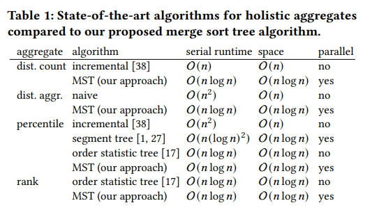
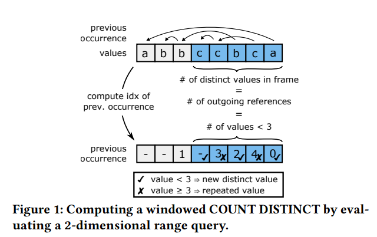
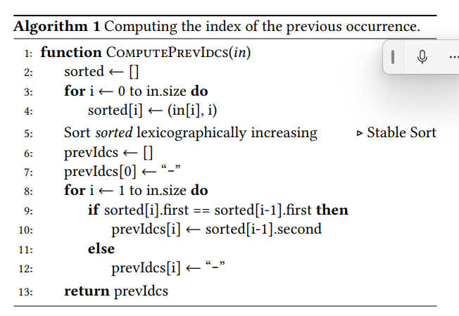

 # SpringBoot 快速开始
 
 ### Spring Boot

 - 自动配置
 - 起步依赖
 - 嵌入式服务器
  

### 实现步骤
1. 创建Maven项目
2. 导入SpringBoot起步依赖
3. 定义Controller
4. 编写引导类 
   
<br>  

## 创建Maven项目
- IDEA new moudle，名字与工件ID相同
- 进入pom.xml添加起步依赖
-  这是项目本身信息
- > 查看maven版本：IDEA -- Setting -- Build... -- Build Tools -- Maven
- [Java8构建](https://start.aliyun.com/)，[SpringBoot3.*构建](https://start.spring.io/)
- xom.pml里添加需要继承的Parent，还有依赖de
- 写好依赖后，如果pom.xml的依赖飘红，手动清理缓存重启IDEA。如果还飘红，pom.xml右键Maven，选重新加载项目
  
## 编写Controller
在Controller前面添加 `@RestController`  
在想添加路径的函数前面添加 `@RequestMapping("path")`


## 编写引导类(sub=Application)
引导类：SpeingBoot项目的入口  <br>
- 在根目录（org.*）下创建类，比如：  
在java文件夹下新建org.group.__Application即可  
<br>
- 在类前加入注解 `@SpringBootApplication`  
<br>
- 编写main函数，格式类似下面：

run方法传参引导类

## 启动
- 运行引导类里的main方法
- 在浏览器访问本地 `localhost:8080[path]`

## 注解
-  SpringBoot默认用jar打包方式
-  入口在引导类main方法
-  net connect 问题，maven依赖pom.xml，右键pom.xml-->maven-->添加settings.xml，添加镜像：
  ```xml
  <mirrors>
        <!-- mirror
         | Specifies a repository mirror site to use instead of a given repository. The repository that
         | this mirror serves has an ID that matches the mirrorOf element of this mirror. IDs are used
         | for inheritance and direct lookup purposes, and must be unique across the set of mirrors.
         |-->
        <mirror>
            <id>nexus-aliyun</id>
            <mirrorOf>*,!jeecg,!jeecg-snapshots</mirrorOf>
            <name>Nexus aliyun</name>
            <url>http://maven.aliyun.com/nexus/content/groups/public</url>
        </mirror>
 
    </mirrors>
  ```