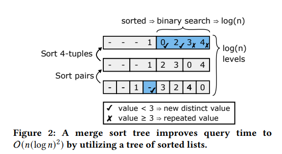
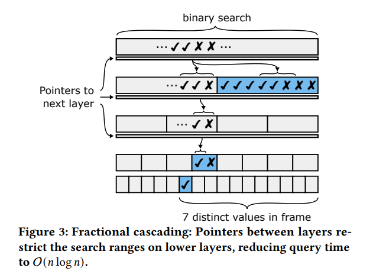
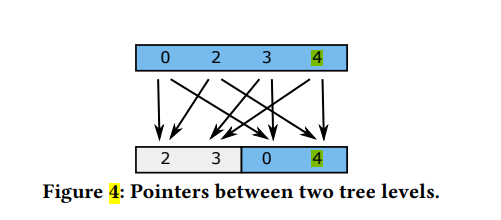
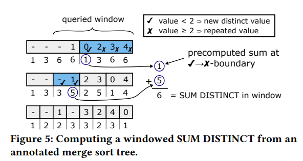
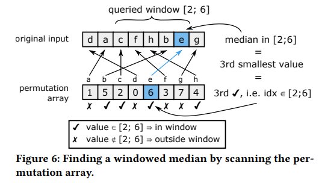
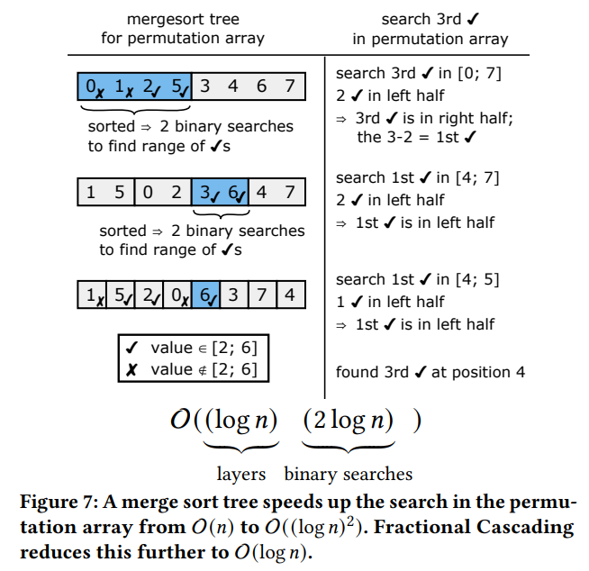

# SpringBoot 配置文件

## 快速构建
IDEA 专业版才有SpringBoot快速构建工具

## pom.xml浅析
- parent：指定继承的父工程信息
- properties: 指定版本信息（不需要加\<property>，直接就是\<*.version>指定版本）
- dependencies：版本锁定，如果继承父工程里有某个工程的坐标，那么就不需要在此工程中提供其坐标  
  
依靠这些配置完成起步依赖

## SpringBoot 配置文件
- **application.properties**（#为注释）

  ```properties
  server.port=8080
  ```
- **application.yml**  

  ```yaml
  server:
    port: 8080   #冒号和值之间有空格
  ```
  yaml与yml是一种格式

项目配置路径：`[project]/src/main/resources/application.properties`  
<br>
配置文件优先级：`properties > yml > yaml`
<br>

## YAML  
### 基本语法
- 大小写敏感
- 数据之前必须有空格
- 缩进表示层级关系
- #也表示注释，注释范围为一整行

### 数据格式
- 对象（map）：键值对的集合
  ```yaml
  person:
    name: BreejojoDe 

  # 行内写法
  person: {name: BreejojoDe}
  ```

- 数组：一组有序值
  ```yaml
  address:
    - Harbin
    - QinHuangDao

  # 行内写法
  address: [Harbin,QinhuangDao]
  ```

- 纯量：即常量
  ```yaml
  msg1: 'hello \n world'  # 单引号不识别转义字符

  msg2: "hello \n world"  # 双引号识别转义字符
  ```
eg: 
### 参数引用
```yaml
name: list

person:
  name: ${name}  # 此处person.name被赋值为name的值"list"
```

## 读取配置内容 

1. `@Value` 注入：在变量前加入 `@Value("${argument_name_in_yaml}")` .  
   
   eg.   
<br>  

2. `Environment` 环境对象调用方法
   - 变量：`private Environment argument_name` ，注意变量所属于 org.springframework.core.env
   - 注解：`@Autowired`  
   - 调用方法：`env_name.getProperty("property_name_in_yaml")`，返回对象的值  
  
   eg. 
<br>

3. `@ConfigurationProperties` 

## profile
进行动态数据切换
### profile配置方式

1. 多文件配置方式  
   
   不同环境的配置文件命名规则：/resources/application-[env_name].properties.   `eg. resources/application-dev.properties`  

   激活配置方法：在application.properties里添加 `spring.profiles.active=[env_name]`，`eg. spring.profiles.active=dev`  

   

2. yml多文档方式
   
   把 application.yml 配置文件分为多个部分，开始和结束以及相互之间用 `---` 隔开。
   - SpringBoot 2.* 版本：
     ```yaml
     ---
     # properties

     spring:
       profiles: [current_area_env_name]
     ---
     
     spring:
       profiles:
         active: [active_env_name]
     ```
   - SpringBoot 3.* 版本：
     ```yml
     ---
     # properties

     spring:
       config:
         activate:
           on-profile: dev
     ---

     spring:
       profile: 
         active: dev
     ```
    - 注：2.7 版本在 IDEA 测试下两种方式兼容

### profile激活方式
1. 上文的配置文件激活
   
2. 虚拟机参数激活
   
3. 命令行参数激活


**jar包 打包方式**  
在 pom.xml 中指定main函数入口：
```xml
    <build>
        <plugins>
            <plugin>
                <groupId>org.springframework.boot</groupId>
                <artifactId>spring-boot-maven-plugin</artifactId>
                <configuration>
                    <mainClass>org.profiles.ProfilesApplication</mainClass>
                </configuration>
            </plugin>
        </plugins>
    </build>

    # mainClass写入main方法类位置
```

打包jar包
maven-生命周期-package


打包成功
  

**jar包 运行**  
在jar包目录下会有打包好的jar文件，用Java运行
```bash
java -jar [package_name]
```
  
**添加激活配置环境的命令行参数**
```bash
java -jar [package_name] --spring.profiles.active=[env_name]
```

**注：测试发现命令行参数指定环境优先级高于配置文件指定环境**